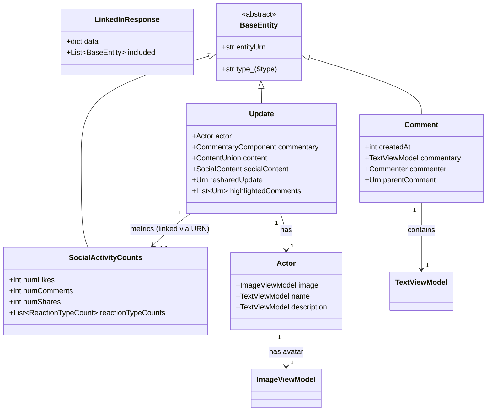
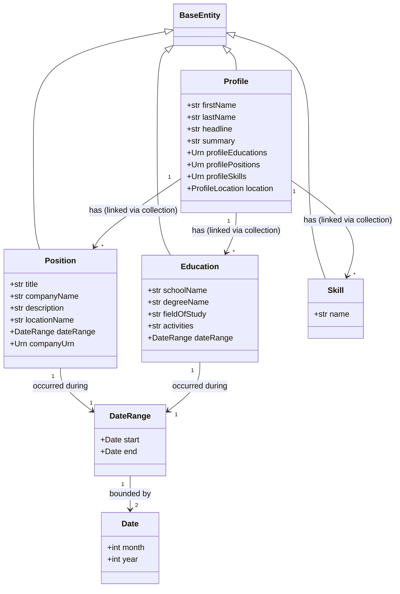

# LinkedIn Voyager API Common Patterns Analysis

This document identifies shared patterns and schemas across `recent-activity-all.json`, `recent-activity-comments.json`, and `recent-activity-reactions.json` to inform the design of Pydantic classes for parsing LinkedIn Voyager API responses.

## 1. Top-Level Response Structure

All files follow a consistent top-level structure:

- **`data`**:
  - **`data`**: Contains the main response object named after the specific query.
    - **`*elements`**: A list of URNs pointing to entities in the `included` array.
    - **`paging`**: Standard pagination metadata (`count`, \`start\`, \`total\`).
    - **`metadata`**: Includes \`paginationToken\`.
- **\`included\`**: A flat array of normalized entities. Each entity has a \`\$type\` and \`entityUrn\`.

## 2. Core Entities & Types (Feed / Activity)

The following entities are common across all activity types:

### 2.1 \`com.linkedin.voyager.dash.feed.Update\`
The primary object for any feed item. Whether it's a post, a comment activity, or a reaction activity, it is represented as an \`Update\`.

**Key Fields:**
- \`entityUrn\`: \`urn:li:fsd_update:(urn:li:activity:[ACTIVITY_ID],...)\`
- \`actor\`: Contains profile/company information (name, image, headline).
- \`commentary\`: Contains the text of the post (if applicable).
- \`content\`: Contains media (video, images, articles).
- \`socialContent\`: Metadata about social interactions (share URL, visibility settings).
- \`resharedUpdate\`: Reference to the original post if the current update is a reshare.

### 2.2 \`com.linkedin.voyager.dash.social.Comment\`
Used in the \`comments.json\` file to represent the actual comment content.

**Key Fields:**
- \`entityUrn\`: \`urn:li:fsd_comment:([COMMENT_ID],urn:li:activity:[ACTIVITY_ID])\`
- \`createdAt\`: Millisecond timestamp.
- \`commentary\`: The text of the comment.
- \`commenter\`: Information about the person who made the comment.

### 2.3 \`com.linkedin.voyager.dash.feed.SocialActivityCounts\`
Contains the metrics for likes, comments, and shares.

**Key Fields:**
- \`numLikes\`, \`numComments\`, \`numShares\`.
- \`reactionTypeCounts\`: Breakdown of reaction types (LIKE, CELEBRATE, etc.).

## 3. Shared Component Types
- **\`TextViewModel\`**: Used for almost all text fields.
  - \`text\`: The raw string.
  - \`attributesV2\`: List of formatting/mention attributes.
- **\`ImageViewModel\`**: Used for profile pictures and post images.
  - \`attributes\`: List of \`ImageAttribute\` (includes \`vectorImage\` with \`rootUrl\` and \`artifacts\`).

## 4. Relationship Mapping

- **Update to Social Counts**: Linked via URN using the activity ID.
- **Update to Comment**: In \`comments.json\`, the \`Update\` entity has a \`*highlightedComments\` field pointing to the \`Comment\` entity.

## 5. Pydantic Class Diagram (Activity)

## 6. Profile Response Analysis

The \`profile.response.json\` also follows the normalized \`data\`/\`included\` pattern. The primary entities are focused on identity and professional history.

### 6.1 Core Profile Entities

- **\`com.linkedin.voyager.dash.identity.profile.Profile\`**: The central entity for user information.
  - \`firstName\`, \`lastName\`, \`headline\`, \`summary\`.
  - Links to other collections via URNs (e.g., \`*profileEducations\`, \`*profilePositions\`).
- **\`com.linkedin.voyager.dash.identity.profile.Position\`**: Represents a job experience.
  - \`title\`, \`companyName\`, \`description\`, \`locationName\`.
  - \`dateRange\`: Start and end dates.
- **\`com.linkedin.voyager.dash.identity.profile.Education\`**: Represents an academic record.
  - \`schoolName\`, \`degreeName\`, \`fieldOfStudy\`, \`activities\`.
- **\`com.linkedin.voyager.dash.identity.profile.Skill\`**: Individual professional skills.

### 6.2 Profile-Specific Components

- **\`DateRange\`**: Used in positions and education.
  - \`start\`, \`end\` (each containing \`month\`, \`year\`).
- **\`ProfileLocation\`**: Geographic information.
  - \`countryCode\`.
- **\`MultiLocaleString\`**: Many fields use a dictionary mapping locale codes to strings (e.g., \`{"en_US": "..."}\`).

### 6.3 Profile Class Diagram (Mermaid)

